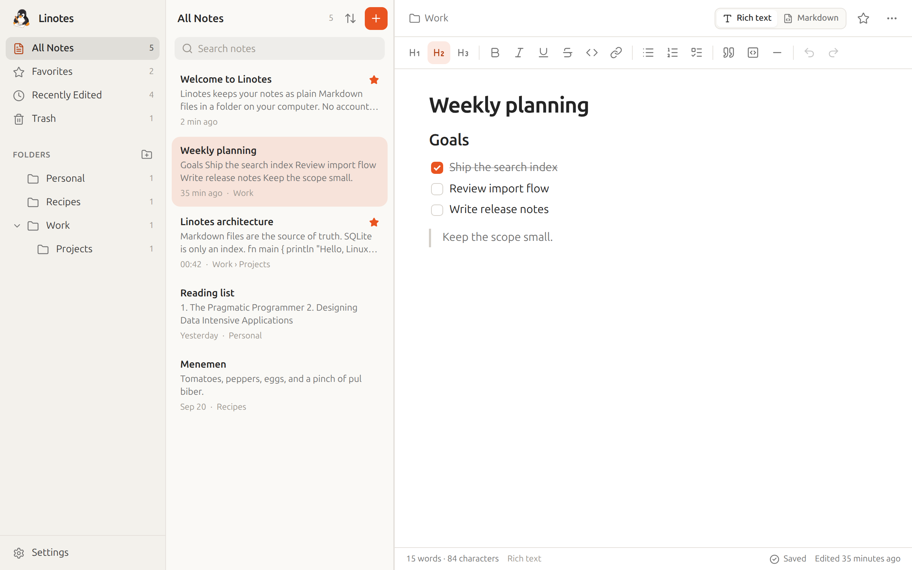
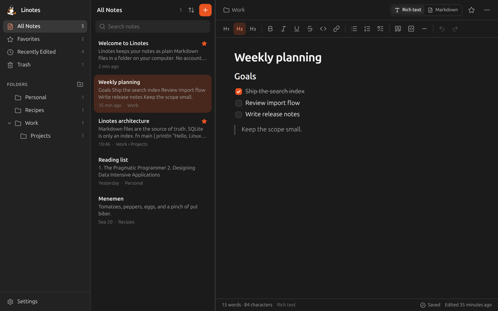

<div align="center">


# Linotes

**Your notes. Your Linux. Your data.**

A fast, private, offline-first notes app for the Linux desktop.<br>
Your notes are plain Markdown files in a folder you choose — no account, no cloud, no tracking.

[](https://github.com/arlkn/linotes/actions/workflows/ci.yml)
[](LICENSE)


</div>

<p align="center">
  
  
</p>

> **Status:** first release (0.1.0). Linotes is fully usable and your notes are always plain files,
> but it is young software — please [report anything that feels off](https://github.com/arlkn/linotes/issues).
> Contributions and feedback are very welcome!

## Why Linotes?

Most note apps either lock your writing into a database or a cloud account, or feel out of place on
the Linux desktop. Linotes takes a different path:

- **Your files, always.** Every note is an ordinary `.md` file with a small YAML header; folders
  are real directories. Open them in Vim, VS Code or GNOME Text Editor, sync them with Syncthing or
  Git, back them up with `cp`. If Linotes disappeared tomorrow, your notes would not.
- **Private by default.** No accounts, analytics, telemetry or ads, and no network requests while you
  write.
- **Careful with your words.** Crash-safe saves, conflict detection when a file changes elsewhere,
  and a rich text editor that refuses to silently rewrite Markdown it can't represent.
- **At home on Linux.** Designed for GNOME and Ubuntu, works on any modern desktop (X11 and
  Wayland), with light/dark themes and complete keyboard control.
- **Free software.** MIT licensed, built in the open with Rust, Tauri, React and SQLite.

## Features

**Writing**
- Rich text editor with headings, bold, italic, underline, strikethrough, inline code, links,
  bulleted/numbered lists, checklists, quotes, dividers and code blocks with syntax highlighting
- Markdown shortcuts while typing (`#`, `-`, `[ ]`, `>`, ```` ``` ````, `**bold**`…)
- A **Markdown mode** for editing the raw source, switchable at any time (`Ctrl+Shift+M`)
- Pasting Markdown text inserts formatted content
- Automatic saving while you type, word and character counts, save status

**Organising**
- Folders (nested), favorites, recently edited notes, and a Trash with restore
- Drag notes onto folders, Favorites or the Trash
- Sort by title, creation date or modification date
- Fast full-text search (SQLite FTS5) with highlighted results, scoped to the current view or
  across all notes; case- and accent-insensitive (`calisma` finds `çalışma`)

**Your files**
- Every note is a `.md` file with a small YAML header; folders are real directories
- Default location `~/Documents/Linotes`, or any folder you choose
- Changes made by other programs (editors, sync tools, Git) appear live
- Linotes never silently overwrites a note that changed on disk — you choose which version to keep
- Import Markdown files and whole folders; export single notes, folders or everything as ZIP

**Desktop**
- Designed for GNOME and Ubuntu, works on any modern Linux desktop (X11 and Wayland)
- Light, dark and follow-system themes with ten accent colours
- Complete keyboard control (see [shortcuts](#keyboard-shortcuts)), interface zoom
- No network access while taking notes; strict sandboxing of the web view

## Installation

Download the package for your distribution from the
[latest release](https://github.com/arlkn/linotes/releases/latest)
(64-bit x86 · requires WebKitGTK 4.1 · Ubuntu 22.04+, Debian 12+, Fedora 38+ or similar).

**Ubuntu, Debian, Linux Mint, Pop!_OS** — download the `.deb`, then:

```bash
sudo apt install ./Linotes_0.1.0_amd64.deb
```

**Fedora, openSUSE** — download the `.rpm`, then:

```bash
sudo dnf install ./Linotes-0.1.0-1.x86_64.rpm
```

**Any distribution** — download the `.AppImage`, make it executable and run it:

```bash
chmod +x Linotes_0.1.0_amd64.AppImage && ./Linotes_0.1.0_amd64.AppImage
```

Each release lists SHA-256 checksums in `SHA256SUMS`; verify a download with
`sha256sum --check --ignore-missing SHA256SUMS`. Store packages (Flathub, Snap Store) are
planned — see [docs/DISTRIBUTION.md](docs/DISTRIBUTION.md). You can also
[build from source](#building-from-source).

## Building from source

### 1. System dependencies

Linotes uses [Tauri 2](https://v2.tauri.app) with WebKitGTK 4.1.

**Ubuntu / Debian** (Ubuntu 22.04+, Debian 12+)

```bash
sudo apt install build-essential curl wget file pkg-config libwebkit2gtk-4.1-dev libssl-dev libxdo-dev libayatana-appindicator3-dev librsvg2-dev
```

**Fedora**

```bash
sudo dnf install webkit2gtk4.1-devel openssl-devel curl wget file libappindicator-gtk3-devel librsvg2-devel libxdo-devel
```

```bash
sudo dnf group install "c-development"
```

**Arch Linux**

```bash
sudo pacman -S --needed webkit2gtk-4.1 base-devel curl wget file openssl appmenu-gtk-module libappindicator-gtk3 librsvg xdotool
```

### 2. Toolchains

- [Rust](https://rustup.rs) 1.90 or newer (stable)
- [Node.js](https://nodejs.org) 22 or newer

### 3. Build

```bash
git clone https://github.com/arlkn/linotes.git
```

```bash
cd linotes && npm install
```

```bash
npm run tauri build
```

Packages are written to `src-tauri/target/release/bundle/` (`deb/`, `rpm/`, `appimage/`).

## Development

```bash
npm run tauri dev
```

This starts the Vite dev server and the desktop app with hot reload. To keep test data away
from your real notes, point Linotes at a throwaway profile:

```bash
LINOTES_PROFILE_DIR=/tmp/linotes-dev npm run tauri dev
```

`npm run dev` alone serves the UI in a normal browser with an **in-memory** backend (sample
notes, nothing is saved) — handy for working on the interface.

| Command | What it does |
| --- | --- |
| `npm run check` | Type-check, lint, format check, frontend tests and Rust tests |
| `npm test` | Frontend unit and integration tests (Vitest) |
| `npm run test:e2e` | End-to-end UI tests in Chromium (Playwright) |
| `npm run test:rust` | Rust unit and integration tests |
| `npm run lint` / `npm run format` | ESLint / Prettier |

See [CONTRIBUTING.md](CONTRIBUTING.md) for details.

## How your notes are stored

```text
~/Documents/Linotes/
├── Welcome to Linotes.md
├── Work/
│   ├── Weekly planning.md
│   └── Projects/
│       └── Roadmap.md
└── .trash/                  ← deleted notes, until you empty the Trash
```

Each note is ordinary Markdown with a YAML header that Linotes manages:

```markdown
---
id: 0b6f7c1e-4c1a-4a5e-9d7e-3d1f0a2b9c11
title: Weekly planning
created: 2026-09-29T08:15:00Z
updated: 2026-09-29T09:02:41Z
favorite: true
---

## Goals

- [x] Ship the search index
- [ ] Review the import flow
```

Other keys you add to the header (tags, aliases, …) are preserved. The search index lives in
`~/.local/share/linotes/` and can be deleted at any time — Linotes rebuilds it from your files.

**Backing up:** copy the notes folder, or sync it with any tool (Syncthing, Nextcloud, rsync,
Git). Nothing else is needed. Details: [docs/STORAGE.md](docs/STORAGE.md).

## Keyboard shortcuts

| Action | Shortcut |
| --- | --- |
| New note / new folder | `Ctrl+N` / `Ctrl+Shift+N` |
| Search | `Ctrl+F` |
| Save now | `Ctrl+S` |
| Favorite | `Ctrl+D` |
| Rich text ↔ Markdown | `Ctrl+Shift+M` |
| Bold / italic / underline | `Ctrl+B` / `Ctrl+I` / `Ctrl+U` |
| Link | `Ctrl+K` (Ctrl+Click opens it) |
| Undo / redo | `Ctrl+Z` / `Ctrl+Shift+Z` |
| Zoom in / out / reset | `Ctrl+Plus` / `Ctrl+Minus` / `Ctrl+0` |
| Switch views | `Alt+1` … `Alt+4` |
| Move between panes | `F6` |
| Toggle sidebar | `F9` |
| Settings | `Ctrl+,` |

The full list is in **Settings → Keyboard Shortcuts**.

## Privacy and security

Linotes has no accounts, analytics, telemetry or advertising, and makes no network requests
during normal use. The web view can only call a fixed list of Linotes commands; it has no direct
access to your files, shell or network. Notes are **not encrypted** by Linotes — use full-disk
encryption to protect them at rest. See [SECURITY.md](SECURITY.md) for the security model.

## Architecture

A Rust backend (Tauri 2) owns all file and database access; a React + TypeScript frontend
renders the interface. Markdown files are the source of truth and SQLite is a rebuildable index.
Read [docs/ARCHITECTURE.md](docs/ARCHITECTURE.md) for the full picture.

## Roadmap

- [x] First public release (0.1.0)
- [ ] Signed release artifacts
- [ ] Flathub and Snap Store packages — see [docs/DISTRIBUTION.md](docs/DISTRIBUTION.md)
- [ ] Tables and images in the rich text editor (they already work in Markdown mode)
- [ ] Links between notes and backlinks
- [ ] Tags from frontmatter as a sidebar filter
- [ ] Translations
- [ ] Optional encrypted notebooks (only after an independent review)

## How Linotes was built

Linotes is openly **AI-assisted**. It was created by Aral Alkan working with
[Claude](https://www.anthropic.com/claude), Anthropic's AI model, through Claude Code:

- **Aral Alkan** set the product vision, requirements and design direction, chose the icon,
  tested the app on Ubuntu, and decides what ships.
- **Claude** wrote the code (the Rust backend and the React interface), the tests, the
  documentation, the build and release workflows and the packaging, and prepared the icon for use
  (removing its background).
- **The icon artwork** was generated with Google Gemini.

Every change is checked by automated tests — Rust unit and integration tests, Vitest, and Playwright
end-to-end tests, including randomized tests that Markdown saving never loses text — plus dependency
audits and CI on a clean machine. Commits made with AI help carry a `Co-Authored-By: Claude` trailer,
so the history shows which changes were AI-assisted.

AI-written code can contain mistakes like any other code. Please review it critically and
[report anything that looks wrong](https://github.com/arlkn/linotes/issues). If you contribute with
the help of AI tools, please say so in your pull request.

## Contributing

Contributions are welcome — please read [CONTRIBUTING.md](CONTRIBUTING.md) and our
[Code of Conduct](CODE_OF_CONDUCT.md). Report security issues as described in
[SECURITY.md](SECURITY.md).

## License

Linotes is free software under the [MIT License](LICENSE).

Linotes is an independent project and is not affiliated with Canonical, Ubuntu or GNOME.
